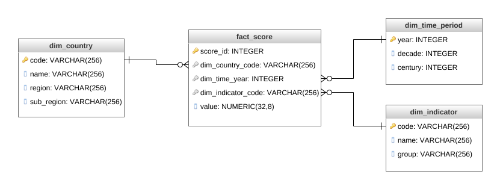

# Data Engineering Capstone Project

### Overview
The purpose of this project is to combine what was learned throughout the program, defining the scope, data and design for a project.

### Project Scope
  The goal is facilitate insights based on the analysis of country indicators. Time and location analyzes make a lot of sense. It can be grouped by time period (year, decade) or by different granularity of locality (countries, regions, sub-regions). In the dimension of indicators it was possible to unite indicators of different bases, being able to separate by type of indicators (personal perceptions, development indicators, economic indicators). An interesting query would be the top 10 countries that most improved rates in the last decade, based on scores from distinct groups of indicators.

### Sources:
- http://datatopics.worldbank.org/world-development-indicators/#archives
- www.kaggle.com/unsdsn/world-happiness
- https://w3.unece.org/PXWeb2015/pxweb/en/STAT/
- https://github.com/lukes/ISO-3166-Countries-with-Regional-Codes/blob/master/all/all.json

### Datasets

- all.json (65.4 kB)
  - contains informations about the countries of world (codes, name, region, sub-region, ...)

- WDIData.csv  (574,3 MB)
  - contains world development indicators per country and year. More information here: https://www.worldbank.org/en/who-we-are

- unece.json (4 MB)
  - contains economic indicators per country and year. More information here: https://www.unece.org/mission.html

- world-happiness.zip (37.7 KB)
  - contains data about world happiness per country. Based on people perceptions about some indicators. More information here: https://worldhappiness.report/ed/2019/
  - I work with 5 files (2015.csv, 2016.csv, 2017.csv, 2018.csv, 2019.csv)
  - PS: the data schema of the people happinness report has been manually adjusted according to the most recent to be read correctly by the ETL. However, if the number of files was large and the changes in the schema were constant, the ideal would be to create a script that automatically corrected for a default schema.

### Data Model

  A star schema with a fact table score and dimensions time, location and indicators as shown in the image below:

 

### Tools and ETL

   After taking the data and placing it on S3, the ETL load, clean and transform this data to creates the dimensions and facts according to the model that was designed and return to the S3 in parquet format.
   The focus was on ETL in this project, since the update frequency is low (annual), so I didn't schedule the airflow pipeline, the idea is a manual run only when new data is loaded.

   - Instructions:
    - Put data in your S3 bucket, change on etl.py the input_data and output_data path on main() method.
    - On dl.cfg file put your aws key and secret key credentials.
    - Run etl.py
      - it was get data on S3 clean, transform and put in dimensions and fact table (model above)
        - clean and transformations done on etl:
            - include year (file name) as a column on happiness report files
            - melt indicators columns of unece and happiness reports files
            - create decade and century columns from year column
            - clean column names
            - cast double and integer types

### Additional questions
  - If the data was increased by 100x.
    - The use of pyspark helps in processing large amounts of data, but change to incremental updates would be important. Or even to increase the processing power of the machines too (EC2 - aws).

  - If the pipelines were run on a daily basis by 7am.
      - If the indicators had metrics generated more frequently than annually, the ideal would be to schedule the pipeline with appropriate frequency. In case you have to run every day at 7 am, the schedule would be 0 7 * * * (https://crontab.guru/#0_7_*_*_*)

  - If the database needed to be accessed by 100+ people.
    - View tools, like tableau, permits that people access the information, which will be processed only at the planned times and will be available for consultation whenever necessary and by as many people as there are.
